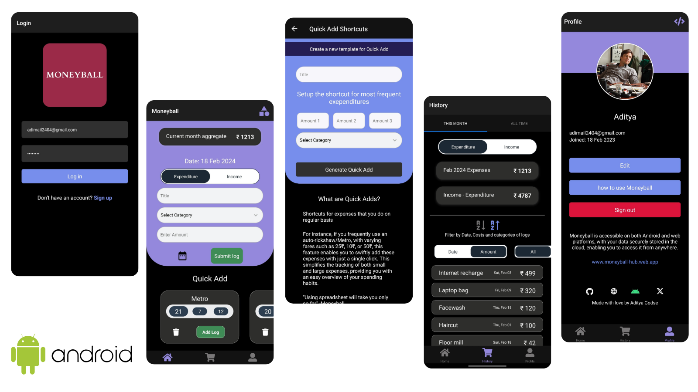
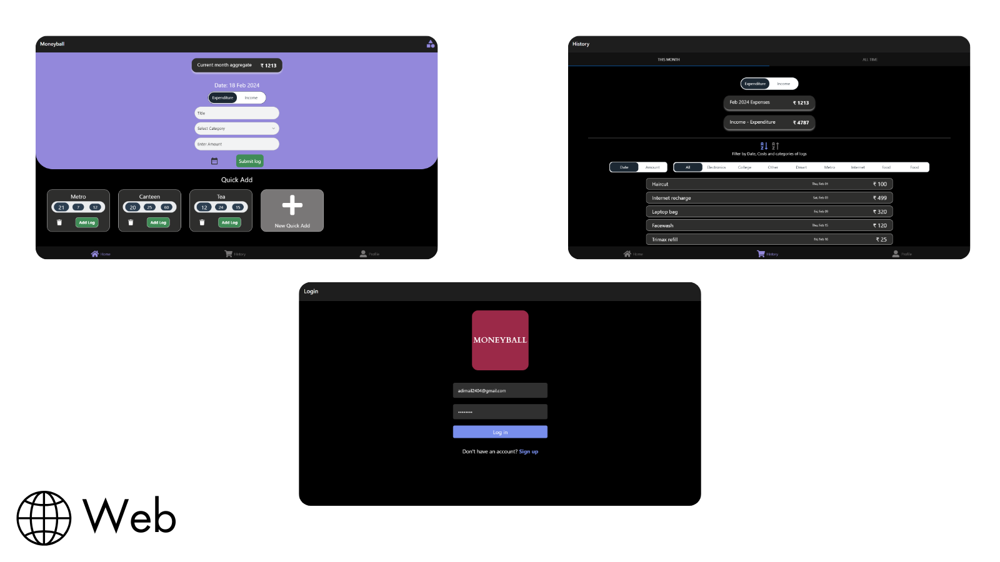
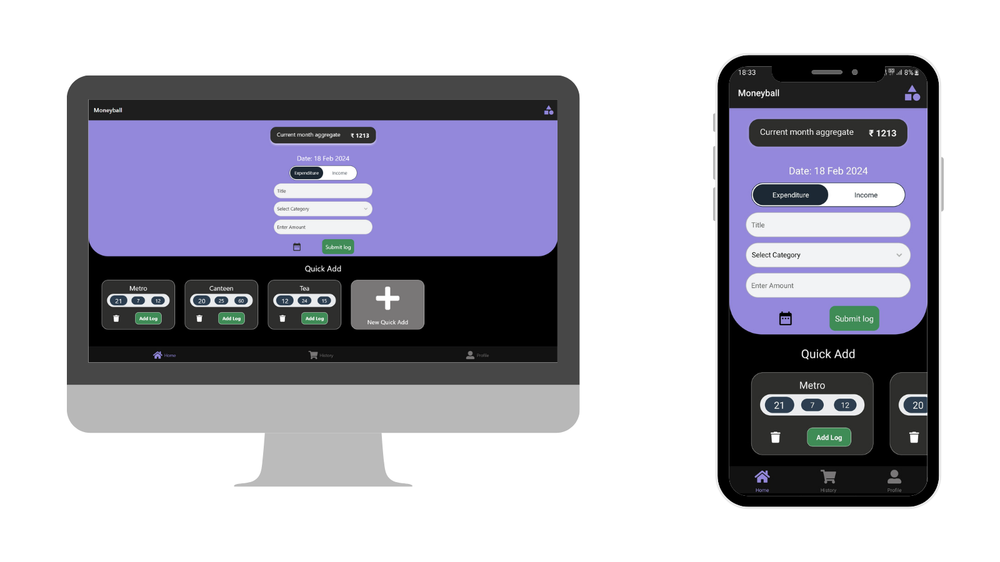

# Moneyball

Cross paltform app to manage financial history via cloud using firebase as a backend. The primary motivation for developing this app instead of relying on Excel was was simple, I needed an abstraction layer in the way I tracked my history. The aim was to streamline the logging process without having to concern with Excel column references, categorization, or monthly segmentation. This way I could just focus on important things leaving the complexities on the backend

### Screenshots (web & android)





## Features

**Application**
- Dark/Light mode
- Cloud storage
- User Authentication

**Services**
- Quick Add frequent expenses
- Track expenses and incomes easily
- Automic monthly categorization

## Quick Add

Shortcuts for expenses that you do on regular basis

For instance, if you frequently use an auto-rickshaw/Metro, with varying fares such as 25₹, 10₹, or 50₹, this feature enables you to swiftly add these expenses with just a single click. This simplifies the tracking of both small and large expenses, providing you with an easy overview of your spending habits.

**"Using spreadsheet will take you only so far" -Moneyball**

## Database modelling


## EAS build

EAS Build is a hosted service for building app binaries for your Expo and React Native projects.

eas.json

```json
{
  "build": {
    "preview": {
      "android": {
        "buildType": "apk"
      }
    },
    "preview2": {
      "android": {
        "gradleCommand": ":app:assembleRelease"
      }
    },
    "preview3": {
      "developmentClient": true
    },
    "preview4": {
      "distribution": "internal"
    },
    "production": {}
  }
}
```

## Build bundles

```shell
eas build -p [android/web/ios] --profile preview
```

Use expo on android or ios to preview the application without the need for installing an imulator on the working machine

## Firebase config

Setup the firebase config at *src/config.js*

Things to include in config.js:

```javascript
const defaultAvatar =
  'https://www.hollywoodreporter.com/wp-content/uploads/2011/12/pittdesk_a.jpg'
// Default profile picture of the user. In my case it is the brad pit from the movie moneyball

const firebaseKey = {
  // apiKey
  // authDomain
  // projectId
  // storageBucket
  // messagingSenderId
  // appId
  // measurementId
}

const expoProjectId // from expo.dev 

export { defaultAvatar, firebaseKey, expoProjectId }
```

## Dependencies

- expo: ~50.0.6
- firebase: 9.6.10
- react: 18.2.0
- react-dom: 18.2.0
- react-native: 0.73.4